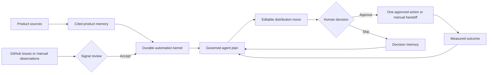

# Distribution-OS

**A local-first, evidence-grounded distribution harness for technical founders.**

[](https://github.com/Vequan23/distribution-os/actions/workflows/quality.yml)
[](https://nodejs.org/)
[](https://vuejs.org/)

Distribution-OS turns product evidence into a repeatable distribution practice: understand the product, propose a small number of source-cited moves, require a human decision, and learn from measured outcomes.

It is built for founders who want consistent distribution without becoming spammers. It is not a bulk outreach engine, a fake-trend generator, or an autonomous social publisher wearing an AI label.

## The idea

Building software is getting cheaper. Earning qualified attention is not.

Most distribution tools optimize one channel or make it easier to send more messages. Distribution-OS treats go-to-market as a closed loop with memory, evidence, policy, and human judgment:



Every proposed move must answer four questions:

1. What product evidence supports this?
2. Who is it useful to?
3. Why is this channel appropriate?
4. What outcome would make the move worth repeating?

## What works today

- Onboarding from a local repository folder, browser folder bundle, public URL, PDF, DOCX, Markdown, text, JSON, YAML, HTML, or pasted context
- Deterministic local brief extraction that works without an AI account
- Optional schema-validated, source-cited AI synthesis for product onboarding
- Separate evidence classes for founder intent, public claims, implementation, audience observations, and outcomes
- A quarantined Signal Inbox where observations must be accepted before they become citable audience evidence
- A read-only GitHub Issues connector with manual sync, pull-request filtering, deduplication, and the same human evidence gate
- Narrow DEV and LinkedIn connectors that publish only separately approved contributions, record receipts, and refresh the outcomes their APIs permit
- Multi-provider model profiles with environment-variable or macOS Keychain credentials
- Vraxis-backed native agents with host-enforced evidence-reading sequences and redacted tool-call audit evidence
- Vraxis-backed schema execution for cited onboarding and bounded plan/draft repair, with project-scoped execution and adapter provenance
- Bounded Claude Code, OpenCode, Codex CLI, and Cursor Agent runtime adapters
- Exact citation verification, one bounded repair attempt, and visible fallback behavior
- A dedicated channel-native contribution writer that reads the opportunity and its supporting evidence before producing editable copy
- Durable evidence-loop playbooks with manual or scheduled triggers, bounded action budgets, idempotent runs, and restart-safe scheduling in SQLite
- A governed Automation workspace with a global pause control, declared adapter capabilities, run/step history, and a kernel-enforced approval boundary
- A reusable Action Fabric connection loop for MCP servers, a bounded GitHub CLI reader, optional MCP-compatible gateways, and human handoffs
- Exact-payload previews and one-time approval for identity-bearing connection calls; dry runs never invoke the transport
- Host-owned policy evaluation that blocks undeclared capabilities, exhausted budgets, missing evidence, arbitrary shell commands, and unapproved identity-bearing actions
- Editable review queue with approve and skip decisions; no implicit publishing
- Per-channel policy and daily-limit configuration
- Durable run ledger containing safe step metadata, failures, fallbacks, decisions, and outcomes
- Manual outcome capture that informs the next planning cycle
- Private SQLite storage outside the product repository
- Vue 3 interface built with [`osx-components`](https://www.npmjs.com/package/osx-components)

## Quick start

Install Distribution OS, then open it:

```bash
npm install -g @vraxis/distribution-os
distribution-os
```

The command starts the local service and opens Distribution OS in your default browser. It requires Node.js 22.12 or later. Use `distribution-os --no-open` to start without opening a browser, or `distribution-os --port 4400` to choose another port. Press Ctrl+C to stop it.

### Your first loop

1. Select **Add Project** and provide at least one product source.
2. Generate and correct the product brief, then approve it as product memory.
3. Optionally open **AI Harness** to configure a model API or installed agent runtime.
4. Connect a public GitHub repository in **Signal Inbox**, or manually capture a bounded public observation.
5. Review new observations in **Signal Inbox**. Only accepted signals become available to planning.
6. Either select **Generate plan** manually, or open **Automation** and create a bounded evidence loop.
7. An automation cycle may refresh read-only connectors, generate a small evidence-cited plan, and prepare founder-editable drafts. It always stops at the review queue.
8. Inspect the evidence and use **Write channel draft** when you want to rewrite a selected opportunity manually.
9. Edit the draft, then approve or skip the move.
10. Complete the approved work through the DEV or LinkedIn connector, a manual handoff, or a verified Action Fabric connection. Every identity-bearing action requires confirmation of the exact payload.
11. Record the observed outcome in Campaigns. The next manual or scheduled cycle receives the accumulated decision and outcome memory.

Use the persistent **Project** switcher in the toolbar to keep one project's recommendations, signals, campaigns, journal, and run evidence in context. Choose **All Projects** for the portfolio view, then open **Projects** to see every onboarded project.

Project and loop deletion use deliberately different semantics. **Delete loop** removes the active schedule while retaining its completed run, decision, and outcome history. **Delete project** requires typing `DELETE` and permanently cascades through that project's evidence, signals, opportunities, outcomes, connectors, automation configuration and runs, harness runs, project-linked action records, and ledger events. An active automation run must finish before either deletion can proceed.

DEV public signal discovery does not require a credential. For founder-approved publishing and authenticated outcome capture, create a key in [DEV Settings → Extensions](https://dev.to/settings/extensions), then use **Channels → DEV → Verify & save securely**. The key is verified before macOS Keychain storage and never enters SQLite. `DEVTO_API_KEY` remains available as a local environment-variable alternative.

LinkedIn founder-approved text publishing uses **Channels → LinkedIn → Connect LinkedIn**. Distribution OS starts a single-use Authorization Code + PKCE session, opens the operating system's default browser, receives LinkedIn's redirect on a random `127.0.0.1` port, verifies the member identity, and stores the resulting credential in macOS Keychain. Set `LINKEDIN_CLIENT_ID` or enter the public client ID in the connection form; never provide the client secret. The LinkedIn developer app must have its native PKCE flow enabled plus Sign in with LinkedIn and Share on LinkedIn access. A manually created `LINKEDIN_ACCESS_TOKEN` remains an advanced local fallback. Reactions and comments are refreshed only when LinkedIn grants the app the necessary Community Management API access. A denied metric read is recorded as a visible sync failure and never changes the confirmed publication receipt.

> **Note:** Refreshing the workspace reloads local dashboard state. It does not silently re-fetch URLs, repositories, or external audience sources.

Public GitHub repositories work without authentication. Set `GITHUB_TOKEN` in the service environment to raise API limits or read a private repository you are authorized to access. The token is read at request time and is never written to the ledger.

## How the harness is governed

The native agent cannot jump directly from a product summary to a confident recommendation. Before it can finish, Distribution-OS requires and verifies these tool reads in sequence:

1. Product memory
2. Product evidence
3. Audience signals
4. Channel policies
5. Prior outcome memory

Tool results are fed into subsequent model steps. The final plan is schema-validated, and every move needs at least one citation matching an exact product-evidence label. Audience observations may strengthen a move, but one observation is never promoted into a trend or proof of demand.

External runtimes receive bounded JSON evidence in a disposable temporary workspace. Their final output passes through the same schema and citation checks before it can enter the review queue.

Runtime discovery proves only that a supported CLI is installed. **Test** in AI Harness runs one synthetic, schema-validated task through the same disposable read-only adapter used by onboarding and planning. Readiness is stored locally for that exact CLI version; upgrading the CLI returns it to **Installed · unverified** until it is tested again. Failed tests retain only a normalized category, bounded explanation, duration, and timestamp—not raw output or credentials.

Post writing is a separate governed loop. The native contribution writer must read the selected opportunity and its supporting evidence before returning one complete channel draft. It updates only the editable draft; approval and public execution remain separate human decisions.

The Automation Kernel orchestrates these existing stages without weakening them. Each playbook has a cadence and preparation budget. Runs are idempotent, persist step-by-step progress in SQLite, tolerate an unavailable observation source without inventing evidence, and stop in `waiting-approval` whenever useful work is prepared. The global pause control stops scheduled sensing and preparation immediately. Scheduled public execution is hard-coded off in this release.

The Action Fabric is the portable capability layer beneath that kernel. Each adapter declares a transport, narrow capabilities, risk, approval policy, public-side-effect status, and a non-secret configuration summary. Registration does not imply trust or connectivity. MCP, CLI, managed-gateway, and user-created handoff manifests begin in `setup-required`; **Test connection** must successfully discover a tool whose inferred capability intersects the manifest before the adapter becomes verified. Unknown MCP operations fail closed, mutation annotations override read-like names, and every call rechecks the current tool list for capability drift. Requests use payload-bound idempotency keys, dry runs never call a transport, and identity-bearing calls can proceed only through the durable one-time approval endpoint. A missing or ambiguous result is failure—not success.

MCP and MCP-compatible gateways use the official Model Context Protocol client. Optional bearer credentials are named by environment variable and read only at connection time; their values are never accepted by the UI or stored in SQLite. The CLI transport currently exposes only a bounded `gh issue list` reader invoked without a shell. Claude Code, Cursor, OpenCode, and Codex remain AI runtimes—not social/action connections. The framework-neutral contracts live in `packages/action-fabric` so future products can reuse the same trust semantics without inheriting Distribution-OS domain logic.

See [Harness architecture](docs/ARCHITECTURE.md) for the detailed lifecycle.

## Model APIs versus agent runtimes

These are intentionally separate layers.

| Layer | What it owns | Supported options |
| --- | --- | --- |
| Model API | Inference for cited onboarding and the native Distribution-OS harness | OpenAI, Anthropic, Google Gemini, DeepSeek, OpenRouter, Groq, Ollama, custom OpenAI-compatible endpoints |
| Agent runtime | Its own model selection, authentication, tools, and internal agent behavior | Claude Code, OpenCode, Codex CLI, Cursor Agent |
| Action Fabric | Capability declaration, policy, budgets, idempotency, approval, and redacted results | Direct APIs, MCP, bounded CLIs, optional managed gateways, human handoffs |

Distribution-OS owns the evidence boundary, temporary workspace, plan schema, citation verification, run ledger, and human approval gate. The selected execution profile powers both cited onboarding and distribution planning; external runtimes continue to own their authentication and tool behavior.

[`@vraxis/agent-v`](https://www.npmjs.com/package/@vraxis/agent-v) provides the provider-neutral contracts beneath native onboarding, schema repair, planning, and contribution writing. Vraxis 0.5 enforces each native agent's exact read-tool sequence at the host adapter, disables tools during final synthesis, and returns a normalized audit containing tool identity, version, step, status, duration, and approval disposition without tool payloads. It also returns engine, adapter, provider, model, and AI SDK runtime provenance. Distribution-OS still owns model-profile resolution, credentials, Zod domain schemas, evidence tools, exact citation verification, retry/fallback policy, and the human approval/publication boundary.

Configure credentials in **AI Harness** or through environment variables:

```bash
OPENAI_API_KEY=
ANTHROPIC_API_KEY=
GOOGLE_API_KEY=
DEEPSEEK_API_KEY=
OPENROUTER_API_KEY=
GROQ_API_KEY=
GITHUB_TOKEN=
```

Keys entered through the macOS UI are stored in Keychain. Use **Test** on a profile before running AI onboarding or plan generation. Installed external runtimes must be authenticated through their own CLI. Use **Test** on the runtime card before relying on it for onboarding or planning; installation alone is not presented as readiness.

## Data, privacy, and security

The default data directory is `~/.distribution-os`:

| Location | Contents |
| --- | --- |
| `distribution-os.sqlite` | Products, bounded evidence, drafts, decisions, safe run metadata, and outcomes |
| `ai-settings.json` | Non-secret provider and runtime configuration |
| macOS Keychain | API keys entered through the UI |

Set `DISTRIBUTION_OS_DATA_DIR` to use another location.

Local-first does not mean that model inference is magically offline. When you select a hosted provider or external runtime, the bounded evidence required for that operation is sent to that provider/runtime. Deterministic onboarding and SQLite storage remain local. Ollama can be used for a local model path.

Additional boundaries:

- Secrets are not written to SQLite, prompts, events, or the repository.
- Action-adapter manifests persist bounded, non-secret connection metadata, discovery state, tool capability mappings, policy decisions, sanitized payload previews, approval timestamps, and locally retained action payloads needed for an approved call. Credential-like argument keys are rejected and common credential patterns in values/results are redacted. Remote MCP endpoints must use HTTPS, reject private/reserved resolution and redirects, credentials cannot be embedded in URLs, bearer values remain in environment variables, and CLI execution is a fixed argument vector without shell evaluation.
- The run ledger excludes raw prompts, private chain-of-thought, complete provider transcripts, and raw runtime stderr.
- Runtime failures are normalized and redacted before persistence.
- Runtime evidence workspaces are disposable and removed after each run.
- URL import resolves and pins DNS, rejects private IPv4/IPv6 targets, revalidates redirects, and enforces a streamed size limit.
- Repository ingestion is bounded and excludes dependency trees, build output, history, and binary files.
- GitHub sync calls only `api.github.com`, imports up to 12 recent non-pull-request issues per sync, and quarantines every imported item for human review.
- No scheduled flow publishes publicly. An identity-bearing Action Fabric connection can run only after the user reviews its exact sanitized payload and explicitly approves that one durable request.

Read [Privacy and trust](docs/PRIVACY.md) for the storage contract.

## Current product boundary

Distribution-OS currently creates evidence-grounded plans and drafts, stores founder-supplied audience observations, records human decisions, and learns from outcomes you enter.

It does **not** yet provide:

- Authenticated publishing beyond the narrow approval-gated DEV and LinkedIn connectors
- Autonomous posting or outreach
- Broad continuous audience monitoring or representative trend detection beyond configured read-only GitHub issue sources
- Automatic product analytics or revenue attribution
- Predictive CAC, LTV, or channel economics
- Cloud sync or collaborative team workspaces

Those capabilities must be connected, observable, and permissioned before the product can claim them. The Action Fabric now closes the local lifecycle from registration through discovery, capability mapping, policy, explicit approval, execution, and a redacted result ledger for MCP, MCP-compatible gateways, the bounded GitHub CLI reader, and manual handoff. It does not claim support for a network merely because an arbitrary MCP tool exists, and it never silently upgrades a discovered tool into public autonomy. The current release is an early, single-user, local-first harness—not a finished growth automation platform.

## Development

```bash
# Install dependencies and start the development servers
npm install
npm run dev

# Unit and integration tests
npm test

# Vue and server type checking
npm run typecheck

# Tests, type checking, and production builds
npm run check

# Run the production-local build
npm run build
npm start

# Preview or build the standalone marketing site
npm run dev:marketing
npm run build:marketing
```

CI runs `npm run check` on Node.js 24 for every push and pull request.

## Design principles

1. Contribution before promotion.
2. Product claims require visible evidence.
3. Public identity remains under human control.
4. Provider inference and harness behavior remain separate.
5. Failures fall back visibly; they never masquerade as AI success.
6. Qualified outcomes matter more than empty impressions.
7. Memory should prevent repetition and improve the next move.
8. Confidence comes from evidence coverage, never model certainty.

## Status

Distribution-OS is in active alpha. The governed evidence-to-outcome loop, local Automation Kernel, LinkedIn OAuth onboarding, and host-controlled Action Fabric connection lifecycle are usable today. Broader monitoring and team collaboration remain roadmap work; an authenticated MCP endpoint can already be connected through a runtime environment credential.

If this problem resonates, open an issue with the distribution workflow you wish existed. Concrete founder workflows are more valuable than generic feature requests.
