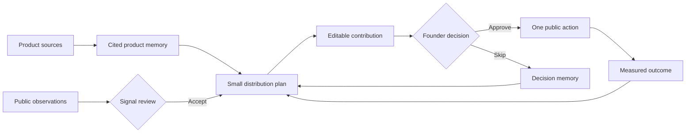

# Distribution OS

**Turn product evidence into distribution decisions.**

[](https://github.com/Vequan23/distribution-os/actions/workflows/quality.yml)
[](https://nodejs.org/)
[](https://vuejs.org/)

Distribution OS is a local-first distribution system for technical founders. It finds source-cited opportunities, prepares drafts, and waits for your approval. It can publish through DEV or LinkedIn, capture the result, and use that result in the next plan.

It does not send cold outreach, invent trends, or publish on a schedule.

```bash
npm install -g @vraxis/distribution-os
distribution-os
```

The command starts the local service and opens the app in your browser. Your projects, evidence, drafts, decisions, and outcomes stay in a private SQLite database on your machine.

## Why this exists

Building software is getting cheaper. Earning qualified attention is not.

Most distribution tools help you send more. Distribution OS helps you decide what is worth doing, why it is worth doing, and what happened afterward.

The loop is simple:



Every proposed move must answer four questions:

1. What product evidence supports it?
2. Who will find it useful?
3. Why does this channel fit?
4. What result would make it worth repeating?

## What works today

### Build product memory

Start with a local repository, public URL, PDF, DOCX, Markdown file, structured data, or pasted context. Distribution OS extracts a brief that you can correct before approval.

The local extractor works without an AI account. You can also use a model API or an installed coding agent for source-cited synthesis.

### Review real signals

Connect GitHub Issues or search public DEV articles. New observations enter the Signal Inbox. They cannot affect a plan until you accept them.

One observation stays one observation. Distribution OS does not call it a trend or proof of demand.

### Prepare cited work

Generate a small plan from product evidence, accepted signals, channel rules, past decisions, and measured outcomes. Every move must cite an exact product-evidence label.

A separate writing step can turn an opportunity into an editable channel draft. It reads the opportunity and its supporting evidence before writing.

### Approve every public action

The review queue lets you edit, approve, or skip each move. Approval does not publish anything. Publishing is a separate action with its own confirmation.

Scheduled automation can refresh sources and prepare drafts. It cannot publish.

### Publish and learn

DEV and LinkedIn can publish one approved contribution after you confirm it. Distribution OS stores the platform receipt and refreshes the metrics each API permits.

Manual channels use a handoff. You can record their outcomes in Campaigns. The next plan receives both manual and connector outcomes.

## Your first distribution loop

1. Select **Add Project** and provide at least one product source.
2. Correct the generated product brief and approve it.
3. Connect GitHub Issues or capture a public observation by hand.
4. Review the Signal Inbox and accept useful observations.
5. Select **Generate plan**, or create an evidence loop in **Automation**.
6. Inspect the evidence behind a proposed move.
7. Edit the draft, then approve or skip it.
8. Publish through DEV or LinkedIn, or complete the manual handoff.
9. Record or refresh the outcome.
10. Generate the next plan with that outcome in context.

Use the **Project** switcher to keep one project's work in context. Select **All Projects** for the portfolio view. Open **Projects** to manage every project.

## Connect a channel

### DEV

Public DEV search needs no credential. Publishing and outcome capture require a DEV API key.

Create a key in [DEV Settings: Extensions](https://dev.to/settings/extensions). Then open **Channels**, choose **DEV**, and select **Verify & save securely**.

Distribution OS verifies the key before saving it to macOS Keychain. It never writes the key to SQLite. You can use `DEVTO_API_KEY` as a local environment variable instead.

### LinkedIn

Open **Channels**, choose **LinkedIn**, and select **Connect LinkedIn**. Distribution OS starts an Authorization Code + PKCE session and opens LinkedIn in your default browser.

The callback uses a random `127.0.0.1` port and a single-use state value. Distribution OS verifies the member identity before it enables publishing. The credential goes to macOS Keychain.

Set `LINKEDIN_CLIENT_ID` or enter the public client ID in the connection form. Never enter a client secret. Your LinkedIn developer app needs native PKCE, Sign in with LinkedIn, and Share on LinkedIn access.

You can use `LINKEDIN_ACCESS_TOKEN` as an advanced local fallback. Reaction and comment reads also require Community Management API access. A denied metric read creates a visible sync failure but keeps the confirmed publication receipt.

## How the harness makes decisions

The native agent cannot jump from a product summary to a recommendation. Distribution OS requires these reads in order:

1. Product memory
2. Product evidence
3. Accepted audience signals
4. Channel policies
5. Prior outcomes

The host verifies the sequence. It then validates the final plan with Zod and checks every citation against an exact evidence label.

External runtimes receive bounded JSON files in a temporary workspace. Their output passes through the same schema and citation checks. Distribution OS deletes the workspace after the run.

See [Harness architecture](docs/ARCHITECTURE.md) for the full lifecycle.

## Models and agent runtimes

Distribution OS keeps model APIs and agent runtimes separate.

**Model APIs** provide inference for onboarding, planning, and writing. Distribution OS supports OpenAI, Anthropic, Google Gemini, DeepSeek, OpenRouter, and Groq. You can also use Ollama or a custom OpenAI-compatible endpoint.

**Agent runtimes** own their own authentication, model selection, and internal behavior. Supported runtimes include Claude Code, OpenCode, Codex CLI, and Cursor Agent.

**Action Fabric** governs external capabilities. It owns declared permissions, budgets, idempotency, approval rules, and redacted results.

Open **AI Harness** to configure a provider or runtime. Distribution OS treats a discovered CLI as installed, not ready. Select **Test** to run a small schema-validated task through the real adapter. Readiness belongs to that CLI version. Test the runtime again after an upgrade.

[`@vraxis/agent-v`](https://www.npmjs.com/package/@vraxis/agent-v) supplies the provider-neutral agent contracts. Distribution OS still owns credentials, domain schemas, evidence tools, citation checks, retry policy, and the public action boundary.

Supported environment variables include:

```bash
OPENAI_API_KEY=
ANTHROPIC_API_KEY=
GOOGLE_API_KEY=
DEEPSEEK_API_KEY=
OPENROUTER_API_KEY=
GROQ_API_KEY=
GITHUB_TOKEN=
```

The macOS app can store provider keys in Keychain. Installed agent runtimes keep their own credentials.

## Automation and connections

Evidence loops run on a manual or scheduled cadence. Each loop has a preparation budget. Runs persist their progress in SQLite and recover safely after a restart.

Useful work stops in `waiting-approval`. The global pause control stops scheduled source sync and draft preparation. Distribution OS never publishes on a schedule.

Action Fabric supports direct APIs, MCP servers, a bounded GitHub CLI reader, MCP-compatible gateways, and human handoffs. A connection starts in `setup-required`. It becomes verified only after **Test connection** finds a tool with the declared capability.

The host blocks undeclared capabilities, missing evidence, exhausted budgets, arbitrary shell commands, and unapproved identity-bearing actions. Dry runs never call the transport. A missing or unclear result counts as failure.

Reusable OAuth code lives in `packages/connection-broker`. It owns PKCE sessions, state checks, loopback callbacks, browser launch, credential encoding, refresh-token rotation, and secure-store adapters. It does not own product evidence, drafts, approval, or publishing policy.

## Data and security

Distribution OS stores local state in `~/.distribution-os`:

| Location | Contents |
| --- | --- |
| `distribution-os.sqlite` | Projects, evidence, drafts, decisions, run records, and outcomes |
| `ai-settings.json` | Non-secret provider and runtime settings |
| macOS Keychain | Credentials entered through the app |

Set `DISTRIBUTION_OS_DATA_DIR` to choose another data directory.

Local-first does not mean every model runs offline. A hosted provider receives the bounded evidence needed for that request. Ollama provides a local model path. Deterministic onboarding and SQLite storage stay local.

Security boundaries include:

- The service binds to `127.0.0.1` and rejects untrusted Host and cross-site mutation requests.
- Secrets stay out of SQLite, prompts, events, logs, and the repository.
- Runtime failures store a short, redacted diagnostic instead of raw output.
- Runtime evidence workspaces are temporary.
- URL imports reject private network targets, unsafe redirects, and oversized responses.
- Repository imports skip dependencies, build output, history, and binary files.
- GitHub sync reads only `api.github.com` and imports at most 12 recent issues.
- Every imported observation enters the Signal Inbox first.
- No scheduled flow can publish.

Read [Privacy and trust](docs/PRIVACY.md) for the storage contract.

## Delete data

**Delete loop** removes the active schedule but keeps completed runs, decisions, and outcomes.

**Delete project** requires typing `DELETE`. It permanently removes the project's evidence, signals, opportunities, outcomes, connectors, automation records, agent runs, action records, and ledger events. An active automation run must finish first.

## Current limits

Distribution OS is an early, single-user local app. It does not provide:

- Publishing outside the approval-gated DEV and LinkedIn connectors
- Automatic outreach
- Representative trend detection from broad audience monitoring
- Automatic product analytics or revenue attribution
- Predictive CAC, LTV, or channel economics
- Cloud sync or team workspaces

An arbitrary MCP tool does not become a trusted channel. Distribution OS requires a declared capability, a verified connection, a policy check, and approval for the exact public action.

## Development

```bash
npm install
npm run dev

# Run tests
npm test

# Run tests, type checks, and the production build
npm run check

# Run the production build locally
npm run build
npm start

# Work on the marketing site
npm run dev:marketing
npm run build:marketing
```

CI runs `npm run check` on Node.js 24 for every push and pull request.

## Principles

1. Contribution before promotion.
2. Product claims need visible evidence.
3. Public identity stays under human control.
4. Provider inference stays separate from harness behavior.
5. Failures stay visible.
6. Qualified outcomes matter more than empty impressions.
7. Memory should improve the next move.
8. Confidence comes from evidence coverage.

## Status

Distribution OS is in active alpha. The evidence-to-outcome loop, local automation, LinkedIn OAuth, and Action Fabric connection lifecycle work today.

Broader monitoring and team collaboration remain future work. If this problem sounds familiar, open an issue with the distribution workflow you wish existed.
