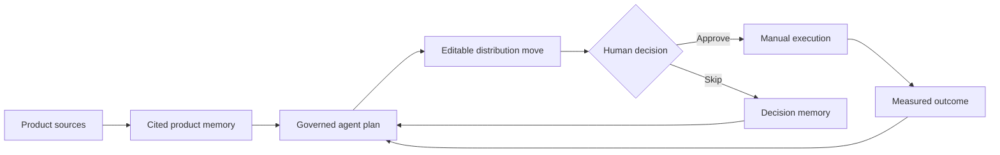

# Distribution-OS

**A local-first, evidence-grounded distribution harness for technical founders.**

[](https://github.com/Vequan23/distribution-os/actions/workflows/quality.yml)
[](https://nodejs.org/)
[](https://vuejs.org/)

Distribution-OS turns product evidence into a repeatable distribution practice: understand the product, propose a small number of source-cited moves, require a human decision, and learn from measured outcomes.

It is built for founders who want consistent distribution without becoming spammers. It is not a bulk outreach engine, a fake-trend generator, or an autonomous social publisher wearing an AI label.

## The idea

Building software is getting cheaper. Earning qualified attention is not.

Most distribution tools optimize one channel or make it easier to send more messages. Distribution-OS treats go-to-market as a closed loop with memory, evidence, policy, and human judgment:



Every proposed move must answer four questions:

1. What product evidence supports this?
2. Who is it useful to?
3. Why is this channel appropriate?
4. What outcome would make the move worth repeating?

## What works today

- Onboarding from a local repository folder, browser folder bundle, public URL, PDF, DOCX, Markdown, text, JSON, YAML, HTML, or pasted context
- Deterministic local brief extraction that works without an AI account
- Optional schema-validated, source-cited AI synthesis for product onboarding
- Separate evidence classes for founder intent, public claims, implementation, audience observations, and outcomes
- Multi-provider model profiles with environment-variable or macOS Keychain credentials
- A native Vercel AI SDK `ToolLoopAgent` with an enforced evidence-reading sequence
- Bounded Claude Code, OpenCode, Codex CLI, and Cursor Agent runtime adapters
- Exact citation verification, one bounded repair attempt, and visible fallback behavior
- Editable review queue with approve and skip decisions; no implicit publishing
- Per-channel policy and daily-limit configuration
- Durable run ledger containing safe step metadata, failures, fallbacks, decisions, and outcomes
- Manual outcome capture that informs the next planning cycle
- Private SQLite storage outside the product repository
- Vue 3 interface built with [`osx-components`](https://www.npmjs.com/package/osx-components)

## Quick start

### Requirements

- Node.js 22.12 or later; Node.js 24 LTS is recommended
- npm

```bash
git clone https://github.com/Vequan23/distribution-os.git
cd distribution-os
npm install
npm run dev
```

Open [http://127.0.0.1:4190](http://127.0.0.1:4190). The Vite app proxies the local service at `http://127.0.0.1:4191`.

### Your first loop

1. Select **Add Product** and provide at least one product source.
2. Generate and correct the product brief, then approve it as product memory.
3. Optionally open **AI Harness** to configure a model API or installed agent runtime.
4. Add real audience context in **Audience Map** when you have a public discussion or bounded observation worth citing.
5. Select **Generate plan** from Product Memory or the Command Center.
6. Inspect the evidence, edit the draft, then approve or skip the move.
7. Execute approved work manually and record the observed outcome in Campaigns.
8. Generate the next plan with the accumulated decision and outcome memory.

> **Note:** Refreshing the workspace reloads local dashboard state. It does not silently re-fetch URLs, repositories, or external audience sources.

## How the harness is governed

The native agent cannot jump directly from a product summary to a confident recommendation. Before it can finish, Distribution-OS requires and verifies these tool reads in sequence:

1. Product memory
2. Product evidence
3. Audience signals
4. Channel policies
5. Prior outcome memory

Tool results are fed into subsequent model steps. The final plan is schema-validated, and every move needs at least one citation matching an exact product-evidence label. Audience observations may strengthen a move, but one observation is never promoted into a trend or proof of demand.

External runtimes receive bounded JSON evidence in a disposable temporary workspace. Their final output passes through the same schema and citation checks before it can enter the review queue.

See [Harness architecture](docs/ARCHITECTURE.md) for the detailed lifecycle.

## Model APIs versus agent runtimes

These are intentionally separate layers.

| Layer | What it owns | Supported options |
| --- | --- | --- |
| Model API | Inference for cited onboarding and the native Distribution-OS harness | OpenAI, Anthropic, Google Gemini, DeepSeek, OpenRouter, Groq, Ollama, custom OpenAI-compatible endpoints |
| Agent runtime | Its own model selection, authentication, tools, and internal agent behavior | Claude Code, OpenCode, Codex CLI, Cursor Agent |

Distribution-OS owns the evidence boundary, temporary workspace, plan schema, citation verification, run ledger, and human approval gate. External runtimes continue to own their authentication and tool behavior.

Configure credentials in **AI Harness** or through environment variables:

```bash
OPENAI_API_KEY=
ANTHROPIC_API_KEY=
GOOGLE_API_KEY=
DEEPSEEK_API_KEY=
OPENROUTER_API_KEY=
GROQ_API_KEY=
```

Keys entered through the macOS UI are stored in Keychain. Use **Test** on a profile before running AI onboarding or plan generation. Installed external runtimes must be authenticated through their own CLI.

## Data, privacy, and security

The default data directory is `~/.distribution-os`:

| Location | Contents |
| --- | --- |
| `distribution-os.sqlite` | Products, bounded evidence, drafts, decisions, safe run metadata, and outcomes |
| `ai-settings.json` | Non-secret provider and runtime configuration |
| macOS Keychain | API keys entered through the UI |

Set `DISTRIBUTION_OS_DATA_DIR` to use another location.

Local-first does not mean that model inference is magically offline. When you select a hosted provider or external runtime, the bounded evidence required for that operation is sent to that provider/runtime. Deterministic onboarding and SQLite storage remain local. Ollama can be used for a local model path.

Additional boundaries:

- Secrets are not written to SQLite, prompts, events, or the repository.
- The run ledger excludes raw prompts, private chain-of-thought, complete provider transcripts, and raw runtime stderr.
- Runtime failures are normalized and redacted before persistence.
- Runtime evidence workspaces are disposable and removed after each run.
- URL import resolves and pins DNS, rejects private IPv4/IPv6 targets, revalidates redirects, and enforces a streamed size limit.
- Repository ingestion is bounded and excludes dependency trees, build output, history, and binary files.
- No current flow publishes publicly or performs an irreversible channel action.

Read [Privacy and trust](docs/PRIVACY.md) for the storage contract.

## Current product boundary

Distribution-OS currently creates evidence-grounded plans and drafts, stores founder-supplied audience observations, records human decisions, and learns from outcomes you enter.

It does **not** yet provide:

- Authenticated social or community connectors
- Autonomous posting or outreach
- Continuous audience monitoring or representative trend detection
- Automatic product analytics or revenue attribution
- Predictive CAC, LTV, or channel economics
- Cloud sync or collaborative team workspaces

Those capabilities must be connected, observable, and permissioned before the product can claim them. The current release is an early, single-user, local-first harness—not a finished growth automation platform.

## Development

```bash
# Unit and integration tests
npm test

# Vue and server type checking
npm run typecheck

# Tests, type checking, and production builds
npm run check

# Run the production-local build
npm run build
npm start
```

CI runs `npm run check` on Node.js 24 for every push and pull request.

## Design principles

1. Contribution before promotion.
2. Product claims require visible evidence.
3. Public identity remains under human control.
4. Provider inference and harness behavior remain separate.
5. Failures fall back visibly; they never masquerade as AI success.
6. Qualified outcomes matter more than empty impressions.
7. Memory should prevent repetition and improve the next move.
8. Confidence comes from evidence coverage, never model certainty.

## Status

Distribution-OS is in active alpha. The governed evidence-to-outcome loop is usable today; managed connectors, background monitoring, and team collaboration remain roadmap work.

If this problem resonates, open an issue with the distribution workflow you wish existed. Concrete founder workflows are more valuable than generic feature requests.
